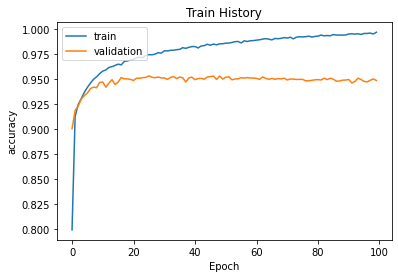
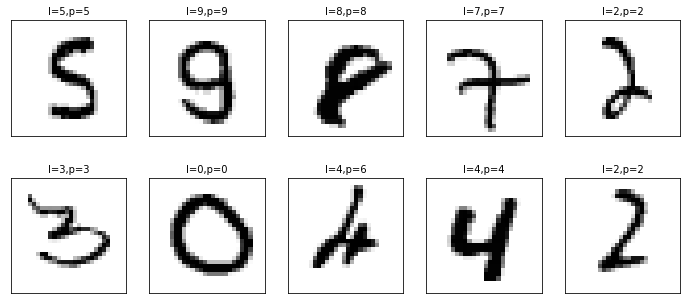
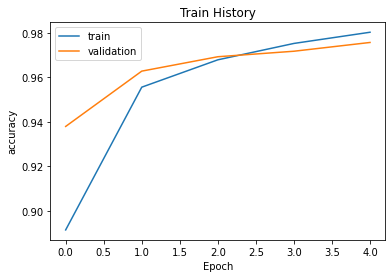
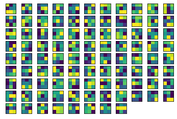
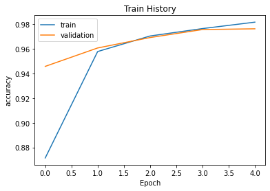
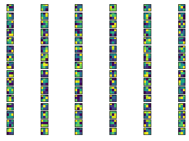
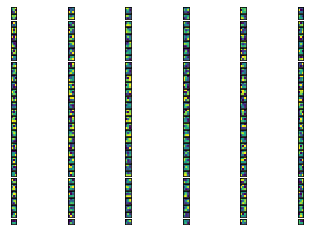
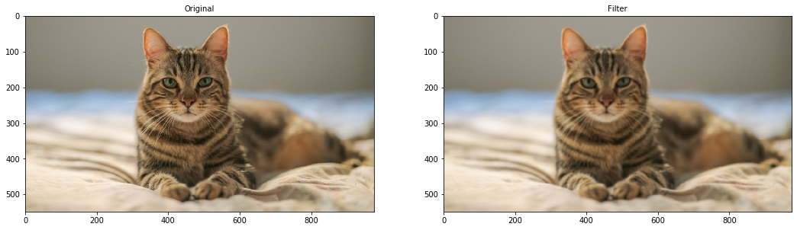
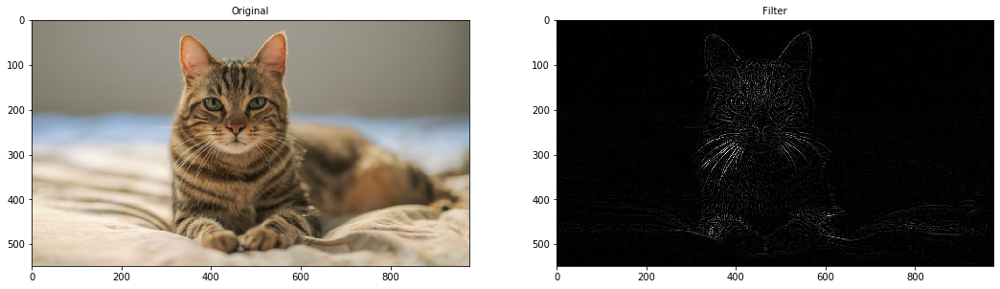

## Mnist_HelloWorld_CNN

- 2021-03-16: 添加image filtering

```python
from tensorflow.python.client import device_lib
print(device_lib.list_local_devices())
```

    [name: "/device:CPU:0"
    device_type: "CPU"
    memory_limit: 268435456
    locality {
    }
    incarnation: 3148300299864707444
    , name: "/device:GPU:0"
    device_type: "GPU"
    memory_limit: 14674281152
    locality {
      bus_id: 1
      links {
      }
    }
    incarnation: 14405985589925203960
    physical_device_desc: "device: 0, name: Tesla T4, pci bus id: 0000:00:04.0, compute capability: 7.5"
    ]
    


```python
import keras
import tensorflow as tf
from keras.datasets import mnist
from keras.models import Sequential
from keras.layers import Dense, Dropout, LeakyReLU, Conv2D, MaxPool2D, Flatten
from keras.optimizers import RMSprop
from keras import backend as K
import os 

# tf2.0使用tf.test.is_gpu_available()來確認機器是否在GPU模式下運行
tf.config.list_physical_devices('GPU')
import matplotlib.pyplot as plt
import numpy as np
```


```python
# the data, shuffled and split between train and test sets
(x_train_o, y_train), (x_test_o, y_test) = mnist.load_data()
plt.imshow(x_train_o[0])
print(y_train[0])

# 拉平
x_train = x_train_o.reshape(60000, 784)
x_test = x_test_o.reshape(10000, 784)

x_train = x_train.astype('float32')
x_test = x_test.astype('float32')

# normalization
x_train /= 255
x_test /= 255
print(x_train.shape[0], 'train samples')
print(x_test.shape[0], 'test samples')
```

    5
    60000 train samples
    10000 test samples
    


```python
# convert class vectors to binary class matrices
# 做一次 one-hot encoding
y_train = keras.utils.to_categorical(y_train)
y_test_n = keras.utils.to_categorical(y_test)

print(y_train[0])
```

    [0. 0. 0. 0. 0. 1. 0. 0. 0. 0.]
    


```python
model = Sequential()
model.add(Dense(20, activation=LeakyReLU(), input_shape=(784,)))
model.add(Dense(20, activation=LeakyReLU()))
model.add(Dense(10, activation='softmax'))
model.summary()
```

    Model: "sequential_1"
    _________________________________________________________________
    Layer (type)                 Output Shape              Param #   
    =================================================================
    dense_2 (Dense)              (None, 20)                15700     
    _________________________________________________________________
    dense_3 (Dense)              (None, 20)                420       
    _________________________________________________________________
    dense_4 (Dense)              (None, 10)                210       
    =================================================================
    Total params: 16,330
    Trainable params: 16,330
    Non-trainable params: 0
    _________________________________________________________________
    


```python
model.compile(loss='categorical_crossentropy',
              optimizer='adam',
              metrics=['accuracy'])
```


```python
batch_size = 128
epochs = 100
history = model.fit(x_train, y_train,
                    batch_size=batch_size,
                    epochs=epochs,
                    verbose=1,
                    validation_split=0.33)
```

    Epoch 1/100
    315/315 [==============================] - 1s 4ms/step - loss: 1.1638 - accuracy: 0.6404 - val_loss: 0.3384 - val_accuracy: 0.9004
    Epoch 2/100
    315/315 [==============================] - 1s 3ms/step - loss: 0.3101 - accuracy: 0.9110 - val_loss: 0.2803 - val_accuracy: 0.9184
    Epoch 3/100
    315/315 [==============================] - 1s 3ms/step - loss: 0.2656 - accuracy: 0.9230 - val_loss: 0.2641 - val_accuracy: 0.9228
    Epoch 4/100
    315/315 [==============================] - 1s 3ms/step - loss: 0.2386 - accuracy: 0.9310 - val_loss: 0.2425 - val_accuracy: 0.9299
    Epoch 5/100
    315/315 [==============================] - 1s 3ms/step - loss: 0.2221 - accuracy: 0.9350 - val_loss: 0.2295 - val_accuracy: 0.9333
    Epoch 6/100
    315/315 [==============================] - 1s 3ms/step - loss: 0.1958 - accuracy: 0.9429 - val_loss: 0.2225 - val_accuracy: 0.9360
    Epoch 7/100
    315/315 [==============================] - 1s 3ms/step - loss: 0.1850 - accuracy: 0.9470 - val_loss: 0.2115 - val_accuracy: 0.9404
    Epoch 8/100
    315/315 [==============================] - 1s 3ms/step - loss: 0.1680 - accuracy: 0.9505 - val_loss: 0.2013 - val_accuracy: 0.9418
    Epoch 9/100
    315/315 [==============================] - 1s 3ms/step - loss: 0.1635 - accuracy: 0.9516 - val_loss: 0.2037 - val_accuracy: 0.9413
    Epoch 10/100
    315/315 [==============================] - 1s 3ms/step - loss: 0.1554 - accuracy: 0.9532 - val_loss: 0.1908 - val_accuracy: 0.9466
    Epoch 11/100
    315/315 [==============================] - 1s 3ms/step - loss: 0.1456 - accuracy: 0.9582 - val_loss: 0.1881 - val_accuracy: 0.9469
    Epoch 12/100
    315/315 [==============================] - 1s 3ms/step - loss: 0.1373 - accuracy: 0.9597 - val_loss: 0.1972 - val_accuracy: 0.9417
    Epoch 13/100
    315/315 [==============================] - 1s 3ms/step - loss: 0.1310 - accuracy: 0.9609 - val_loss: 0.1893 - val_accuracy: 0.9459
    Epoch 14/100
    315/315 [==============================] - 1s 3ms/step - loss: 0.1241 - accuracy: 0.9629 - val_loss: 0.1809 - val_accuracy: 0.9492
    Epoch 15/100
    315/315 [==============================] - 1s 3ms/step - loss: 0.1174 - accuracy: 0.9648 - val_loss: 0.1904 - val_accuracy: 0.9444
    Epoch 16/100
    315/315 [==============================] - 1s 3ms/step - loss: 0.1147 - accuracy: 0.9666 - val_loss: 0.1905 - val_accuracy: 0.9469
    Epoch 17/100
    315/315 [==============================] - 1s 4ms/step - loss: 0.1222 - accuracy: 0.9629 - val_loss: 0.1740 - val_accuracy: 0.9514
    Epoch 18/100
    315/315 [==============================] - 1s 3ms/step - loss: 0.1069 - accuracy: 0.9676 - val_loss: 0.1787 - val_accuracy: 0.9501
    Epoch 19/100
    315/315 [==============================] - 1s 3ms/step - loss: 0.1084 - accuracy: 0.9678 - val_loss: 0.1811 - val_accuracy: 0.9501
    Epoch 20/100
    315/315 [==============================] - 1s 3ms/step - loss: 0.1005 - accuracy: 0.9692 - val_loss: 0.1795 - val_accuracy: 0.9494
    Epoch 21/100
    315/315 [==============================] - 1s 3ms/step - loss: 0.0950 - accuracy: 0.9712 - val_loss: 0.1850 - val_accuracy: 0.9485
    Epoch 22/100
    315/315 [==============================] - 1s 3ms/step - loss: 0.0936 - accuracy: 0.9719 - val_loss: 0.1803 - val_accuracy: 0.9508
    Epoch 23/100
    315/315 [==============================] - 1s 4ms/step - loss: 0.0987 - accuracy: 0.9703 - val_loss: 0.1766 - val_accuracy: 0.9506
    Epoch 24/100
    315/315 [==============================] - 1s 3ms/step - loss: 0.1015 - accuracy: 0.9690 - val_loss: 0.1758 - val_accuracy: 0.9513
    Epoch 25/100
    315/315 [==============================] - 1s 3ms/step - loss: 0.0883 - accuracy: 0.9727 - val_loss: 0.1765 - val_accuracy: 0.9515
    Epoch 26/100
    315/315 [==============================] - 1s 3ms/step - loss: 0.0839 - accuracy: 0.9740 - val_loss: 0.1729 - val_accuracy: 0.9530
    Epoch 27/100
    315/315 [==============================] - 1s 3ms/step - loss: 0.0808 - accuracy: 0.9747 - val_loss: 0.1765 - val_accuracy: 0.9517
    Epoch 28/100
    315/315 [==============================] - 1s 3ms/step - loss: 0.0813 - accuracy: 0.9752 - val_loss: 0.1758 - val_accuracy: 0.9512
    Epoch 29/100
    315/315 [==============================] - 1s 3ms/step - loss: 0.0769 - accuracy: 0.9769 - val_loss: 0.1763 - val_accuracy: 0.9519
    Epoch 30/100
    315/315 [==============================] - 1s 3ms/step - loss: 0.0823 - accuracy: 0.9733 - val_loss: 0.1800 - val_accuracy: 0.9509
    Epoch 31/100
    315/315 [==============================] - 1s 3ms/step - loss: 0.0694 - accuracy: 0.9795 - val_loss: 0.1815 - val_accuracy: 0.9510
    Epoch 32/100
    315/315 [==============================] - 1s 3ms/step - loss: 0.0704 - accuracy: 0.9794 - val_loss: 0.1848 - val_accuracy: 0.9495
    Epoch 33/100
    315/315 [==============================] - 1s 4ms/step - loss: 0.0710 - accuracy: 0.9795 - val_loss: 0.1808 - val_accuracy: 0.9515
    Epoch 34/100
    315/315 [==============================] - 1s 4ms/step - loss: 0.0668 - accuracy: 0.9798 - val_loss: 0.1860 - val_accuracy: 0.9523
    Epoch 35/100
    315/315 [==============================] - 1s 3ms/step - loss: 0.0653 - accuracy: 0.9802 - val_loss: 0.1861 - val_accuracy: 0.9503
    Epoch 36/100
    315/315 [==============================] - 1s 3ms/step - loss: 0.0668 - accuracy: 0.9795 - val_loss: 0.1861 - val_accuracy: 0.9519
    Epoch 37/100
    315/315 [==============================] - 1s 3ms/step - loss: 0.0582 - accuracy: 0.9829 - val_loss: 0.1859 - val_accuracy: 0.9512
    Epoch 38/100
    315/315 [==============================] - 1s 3ms/step - loss: 0.0606 - accuracy: 0.9821 - val_loss: 0.2010 - val_accuracy: 0.9469
    Epoch 39/100
    315/315 [==============================] - 1s 3ms/step - loss: 0.0604 - accuracy: 0.9813 - val_loss: 0.1934 - val_accuracy: 0.9510
    Epoch 40/100
    315/315 [==============================] - 1s 4ms/step - loss: 0.0559 - accuracy: 0.9835 - val_loss: 0.1885 - val_accuracy: 0.9517
    Epoch 41/100
    315/315 [==============================] - 1s 3ms/step - loss: 0.0558 - accuracy: 0.9835 - val_loss: 0.1931 - val_accuracy: 0.9492
    Epoch 42/100
    315/315 [==============================] - 1s 3ms/step - loss: 0.0726 - accuracy: 0.9788 - val_loss: 0.1930 - val_accuracy: 0.9504
    Epoch 43/100
    315/315 [==============================] - 1s 3ms/step - loss: 0.0581 - accuracy: 0.9821 - val_loss: 0.2002 - val_accuracy: 0.9506
    Epoch 44/100
    315/315 [==============================] - 1s 4ms/step - loss: 0.0520 - accuracy: 0.9841 - val_loss: 0.2030 - val_accuracy: 0.9496
    Epoch 45/100
    315/315 [==============================] - 1s 3ms/step - loss: 0.0497 - accuracy: 0.9850 - val_loss: 0.1969 - val_accuracy: 0.9519
    Epoch 46/100
    315/315 [==============================] - 1s 3ms/step - loss: 0.0523 - accuracy: 0.9844 - val_loss: 0.1961 - val_accuracy: 0.9523
    Epoch 47/100
    315/315 [==============================] - 1s 3ms/step - loss: 0.0504 - accuracy: 0.9851 - val_loss: 0.1984 - val_accuracy: 0.9528
    Epoch 48/100
    315/315 [==============================] - 1s 3ms/step - loss: 0.0495 - accuracy: 0.9851 - val_loss: 0.2116 - val_accuracy: 0.9495
    Epoch 49/100
    315/315 [==============================] - 1s 3ms/step - loss: 0.0466 - accuracy: 0.9861 - val_loss: 0.1978 - val_accuracy: 0.9529
    Epoch 50/100
    315/315 [==============================] - 1s 3ms/step - loss: 0.0461 - accuracy: 0.9859 - val_loss: 0.2122 - val_accuracy: 0.9499
    Epoch 51/100
    315/315 [==============================] - 1s 3ms/step - loss: 0.0467 - accuracy: 0.9860 - val_loss: 0.2089 - val_accuracy: 0.9516
    Epoch 52/100
    315/315 [==============================] - 1s 3ms/step - loss: 0.0418 - accuracy: 0.9870 - val_loss: 0.2072 - val_accuracy: 0.9522
    Epoch 53/100
    315/315 [==============================] - 1s 3ms/step - loss: 0.0418 - accuracy: 0.9870 - val_loss: 0.2212 - val_accuracy: 0.9491
    Epoch 54/100
    315/315 [==============================] - 1s 3ms/step - loss: 0.0413 - accuracy: 0.9876 - val_loss: 0.2197 - val_accuracy: 0.9499
    Epoch 55/100
    315/315 [==============================] - 1s 3ms/step - loss: 0.0392 - accuracy: 0.9884 - val_loss: 0.2185 - val_accuracy: 0.9501
    Epoch 56/100
    315/315 [==============================] - 1s 3ms/step - loss: 0.0449 - accuracy: 0.9861 - val_loss: 0.2160 - val_accuracy: 0.9512
    Epoch 57/100
    315/315 [==============================] - 1s 3ms/step - loss: 0.0399 - accuracy: 0.9887 - val_loss: 0.2184 - val_accuracy: 0.9508
    Epoch 58/100
    315/315 [==============================] - 1s 3ms/step - loss: 0.0428 - accuracy: 0.9869 - val_loss: 0.2199 - val_accuracy: 0.9513
    Epoch 59/100
    315/315 [==============================] - 1s 3ms/step - loss: 0.0368 - accuracy: 0.9886 - val_loss: 0.2226 - val_accuracy: 0.9509
    Epoch 60/100
    315/315 [==============================] - 1s 3ms/step - loss: 0.0363 - accuracy: 0.9896 - val_loss: 0.2266 - val_accuracy: 0.9508
    Epoch 61/100
    315/315 [==============================] - 1s 3ms/step - loss: 0.0379 - accuracy: 0.9883 - val_loss: 0.2278 - val_accuracy: 0.9505
    Epoch 62/100
    315/315 [==============================] - 1s 3ms/step - loss: 0.0375 - accuracy: 0.9887 - val_loss: 0.2348 - val_accuracy: 0.9495
    Epoch 63/100
    315/315 [==============================] - 1s 3ms/step - loss: 0.0346 - accuracy: 0.9898 - val_loss: 0.2311 - val_accuracy: 0.9519
    Epoch 64/100
    315/315 [==============================] - 1s 3ms/step - loss: 0.0319 - accuracy: 0.9907 - val_loss: 0.2332 - val_accuracy: 0.9505
    Epoch 65/100
    315/315 [==============================] - 1s 3ms/step - loss: 0.0319 - accuracy: 0.9898 - val_loss: 0.2320 - val_accuracy: 0.9496
    Epoch 66/100
    315/315 [==============================] - 1s 3ms/step - loss: 0.0330 - accuracy: 0.9900 - val_loss: 0.2380 - val_accuracy: 0.9506
    Epoch 67/100
    315/315 [==============================] - 1s 3ms/step - loss: 0.0316 - accuracy: 0.9903 - val_loss: 0.2435 - val_accuracy: 0.9496
    Epoch 68/100
    315/315 [==============================] - 1s 3ms/step - loss: 0.0300 - accuracy: 0.9907 - val_loss: 0.2395 - val_accuracy: 0.9504
    Epoch 69/100
    315/315 [==============================] - 1s 4ms/step - loss: 0.0300 - accuracy: 0.9910 - val_loss: 0.2477 - val_accuracy: 0.9499
    Epoch 70/100
    315/315 [==============================] - 1s 3ms/step - loss: 0.0277 - accuracy: 0.9921 - val_loss: 0.2454 - val_accuracy: 0.9508
    Epoch 71/100
    315/315 [==============================] - 1s 3ms/step - loss: 0.0290 - accuracy: 0.9911 - val_loss: 0.2533 - val_accuracy: 0.9489
    Epoch 72/100
    315/315 [==============================] - 1s 4ms/step - loss: 0.0257 - accuracy: 0.9923 - val_loss: 0.2522 - val_accuracy: 0.9499
    Epoch 73/100
    315/315 [==============================] - 1s 3ms/step - loss: 0.0292 - accuracy: 0.9909 - val_loss: 0.2556 - val_accuracy: 0.9498
    Epoch 74/100
    315/315 [==============================] - 1s 4ms/step - loss: 0.0276 - accuracy: 0.9925 - val_loss: 0.2588 - val_accuracy: 0.9494
    Epoch 75/100
    315/315 [==============================] - 1s 3ms/step - loss: 0.0261 - accuracy: 0.9925 - val_loss: 0.2545 - val_accuracy: 0.9495
    Epoch 76/100
    315/315 [==============================] - 1s 3ms/step - loss: 0.0266 - accuracy: 0.9922 - val_loss: 0.2574 - val_accuracy: 0.9495
    Epoch 77/100
    315/315 [==============================] - 1s 3ms/step - loss: 0.0238 - accuracy: 0.9936 - val_loss: 0.2683 - val_accuracy: 0.9481
    Epoch 78/100
    315/315 [==============================] - 1s 3ms/step - loss: 0.0248 - accuracy: 0.9937 - val_loss: 0.2646 - val_accuracy: 0.9482
    Epoch 79/100
    315/315 [==============================] - 1s 3ms/step - loss: 0.0283 - accuracy: 0.9908 - val_loss: 0.2684 - val_accuracy: 0.9486
    Epoch 80/100
    315/315 [==============================] - 1s 3ms/step - loss: 0.0248 - accuracy: 0.9930 - val_loss: 0.2698 - val_accuracy: 0.9491
    Epoch 81/100
    315/315 [==============================] - 1s 3ms/step - loss: 0.0220 - accuracy: 0.9936 - val_loss: 0.2739 - val_accuracy: 0.9493
    Epoch 82/100
    315/315 [==============================] - 1s 3ms/step - loss: 0.0211 - accuracy: 0.9949 - val_loss: 0.2741 - val_accuracy: 0.9489
    Epoch 83/100
    315/315 [==============================] - 1s 3ms/step - loss: 0.0244 - accuracy: 0.9925 - val_loss: 0.2676 - val_accuracy: 0.9508
    Epoch 84/100
    315/315 [==============================] - 1s 4ms/step - loss: 0.0215 - accuracy: 0.9945 - val_loss: 0.2778 - val_accuracy: 0.9493
    Epoch 85/100
    315/315 [==============================] - 1s 3ms/step - loss: 0.0271 - accuracy: 0.9917 - val_loss: 0.2744 - val_accuracy: 0.9507
    Epoch 86/100
    315/315 [==============================] - 1s 3ms/step - loss: 0.0201 - accuracy: 0.9945 - val_loss: 0.2783 - val_accuracy: 0.9496
    Epoch 87/100
    315/315 [==============================] - 1s 3ms/step - loss: 0.0204 - accuracy: 0.9950 - val_loss: 0.2921 - val_accuracy: 0.9477
    Epoch 88/100
    315/315 [==============================] - 1s 3ms/step - loss: 0.0200 - accuracy: 0.9946 - val_loss: 0.2921 - val_accuracy: 0.9479
    Epoch 89/100
    315/315 [==============================] - 1s 3ms/step - loss: 0.0222 - accuracy: 0.9933 - val_loss: 0.2930 - val_accuracy: 0.9487
    Epoch 90/100
    315/315 [==============================] - 1s 3ms/step - loss: 0.0255 - accuracy: 0.9927 - val_loss: 0.2846 - val_accuracy: 0.9488
    Epoch 91/100
    315/315 [==============================] - 1s 3ms/step - loss: 0.0181 - accuracy: 0.9951 - val_loss: 0.2939 - val_accuracy: 0.9494
    Epoch 92/100
    315/315 [==============================] - 1s 3ms/step - loss: 0.0153 - accuracy: 0.9965 - val_loss: 0.3045 - val_accuracy: 0.9459
    Epoch 93/100
    315/315 [==============================] - 1s 3ms/step - loss: 0.0203 - accuracy: 0.9945 - val_loss: 0.3097 - val_accuracy: 0.9474
    Epoch 94/100
    315/315 [==============================] - 1s 3ms/step - loss: 0.0188 - accuracy: 0.9952 - val_loss: 0.2953 - val_accuracy: 0.9507
    Epoch 95/100
    315/315 [==============================] - 1s 3ms/step - loss: 0.0184 - accuracy: 0.9946 - val_loss: 0.2991 - val_accuracy: 0.9494
    Epoch 96/100
    315/315 [==============================] - 1s 3ms/step - loss: 0.0166 - accuracy: 0.9958 - val_loss: 0.3127 - val_accuracy: 0.9475
    Epoch 97/100
    315/315 [==============================] - 1s 3ms/step - loss: 0.0197 - accuracy: 0.9946 - val_loss: 0.3216 - val_accuracy: 0.9471
    Epoch 98/100
    315/315 [==============================] - 1s 3ms/step - loss: 0.0175 - accuracy: 0.9953 - val_loss: 0.3112 - val_accuracy: 0.9486
    Epoch 99/100
    315/315 [==============================] - 1s 3ms/step - loss: 0.0210 - accuracy: 0.9937 - val_loss: 0.3076 - val_accuracy: 0.9500
    Epoch 100/100
    315/315 [==============================] - 1s 3ms/step - loss: 0.0142 - accuracy: 0.9969 - val_loss: 0.3128 - val_accuracy: 0.9484
    


```python
result= model.evaluate(x_test, y_test_n)
print("test Acc:", result[1])
```

    313/313 [==============================] - 1s 2ms/step - loss: 0.2832 - accuracy: 0.9557
    test Acc: 0.9556999802589417
    


```python
def show_train_history(train_history, train, validation):  
    plt.plot(train_history.history[train])  
    plt.plot(train_history.history[validation])  
    plt.title('Train History')  
    plt.ylabel(train)  
    plt.xlabel('Epoch')  
    plt.legend(['train', 'validation'], loc='upper left')  
    plt.show()  
show_train_history(history, 'accuracy', 'val_accuracy')  
```





```python
def plot_images_labels_predict(images, labels, prediction, idx, num=10):  
    fig = plt.gcf()  
    fig.set_size_inches(12, 14)  
    if num > 25: num = 25  
    for i in range(0, num):  
        ax=plt.subplot(5,5, 1+i)  
        ax.imshow(images[idx], cmap='binary')  
        title = "l=" + str(labels[idx])  
        if len(prediction) > 0:  
            title = "l={},p={}".format(str(labels[idx]), str(prediction[idx]))  
        else:  
            title = "l={}".format(str(labels[idx]))  
        ax.set_title(title, fontsize=10)  
        ax.set_xticks([]); ax.set_yticks([])  
        idx+=1  
    plt.show()  

def isDisplayAvl():  
    return True

print("\t[Info] Making prediction to x_test")  
prediction = model.predict_classes(x_test)   
print()  
print("\t[Info] Show 10 prediction result (From 240):")  
print("%s\n" % (prediction[240:250]))  
  
if isDisplayAvl():
  plot_images_labels_predict(x_test_o, y_test, prediction, idx=240)  
  
print("\t[Info] Error analysis:")  
for i in range(240,250):  
  if prediction[i] != y_test[i]:  
    print("\tAt %d'th: %d is with wrong prediction as %d!" % (i, y_test[i], prediction[i]))  
```

        [Info] Making prediction to x_test
    

    /usr/local/lib/python3.6/dist-packages/tensorflow/python/keras/engine/sequential.py:450: UserWarning: `model.predict_classes()` is deprecated and will be removed after 2021-01-01. Please use instead:* `np.argmax(model.predict(x), axis=-1)`,   if your model does multi-class classification   (e.g. if it uses a `softmax` last-layer activation).* `(model.predict(x) > 0.5).astype("int32")`,   if your model does binary classification   (e.g. if it uses a `sigmoid` last-layer activation).
      warnings.warn('`model.predict_classes()` is deprecated and '
    

    
        [Info] Show 10 prediction result (From 240):
    [5 9 8 7 2 3 0 6 4 2]
    
    





        [Info] Error analysis:
        At 247'th: 4 is with wrong prediction as 6!
    

## 使用ＣＮＮ


```python
(X_train, Y_train), (X_test, Y_test) = mnist.load_data()
X_train = X_train.reshape(60000, 1, 28, 28)/255
X_test = X_test.reshape(10000, 1, 28, 28)/255
Y_train = keras.utils.to_categorical(Y_train)
Y_test = keras.utils.to_categorical(Y_test)
```


```python
model1 = Sequential()
model1.add(Conv2D(filters=32, kernel_size=3, input_shape=(1, 28, 28), activation='relu', padding='same'))
model1.add(MaxPool2D(pool_size=2, data_format='channels_first'))
model1.add(Flatten())
model1.add(Dense(256, activation='relu'))
model1.add(Dense(10, activation='softmax'))
model1.summary()
```

    Model: "sequential_2"
    _________________________________________________________________
    Layer (type)                 Output Shape              Param #   
    =================================================================
    conv2d_1 (Conv2D)            (None, 1, 28, 32)         8096      
    _________________________________________________________________
    max_pooling2d_1 (MaxPooling2 (None, 1, 14, 16)         0         
    _________________________________________________________________
    flatten_1 (Flatten)          (None, 224)               0         
    _________________________________________________________________
    dense_5 (Dense)              (None, 256)               57600     
    _________________________________________________________________
    dense_6 (Dense)              (None, 10)                2570      
    =================================================================
    Total params: 68,266
    Trainable params: 68,266
    Non-trainable params: 0
    _________________________________________________________________
    


```python
model1.compile(loss='categorical_crossentropy', optimizer='adam', metrics=['accuracy'])
h = model1.fit(X_train, Y_train, epochs=5, batch_size=64, verbose=1, validation_split=0.33)

loss, accuracy = model1.evaluate(X_test, Y_test)
print('Test:')
print('Loss: %s\nAccuracy: %s' % (loss, accuracy))

show_train_history(h, 'accuracy', 'val_accuracy')  
```

    Epoch 1/5
    629/629 [==============================] - 3s 4ms/step - loss: 0.6976 - accuracy: 0.8021 - val_loss: 0.1972 - val_accuracy: 0.9379
    Epoch 2/5
    629/629 [==============================] - 2s 4ms/step - loss: 0.1623 - accuracy: 0.9513 - val_loss: 0.1233 - val_accuracy: 0.9627
    Epoch 3/5
    629/629 [==============================] - 2s 4ms/step - loss: 0.1094 - accuracy: 0.9659 - val_loss: 0.1029 - val_accuracy: 0.9692
    Epoch 4/5
    629/629 [==============================] - 2s 3ms/step - loss: 0.0821 - accuracy: 0.9744 - val_loss: 0.0919 - val_accuracy: 0.9717
    Epoch 5/5
    629/629 [==============================] - 2s 3ms/step - loss: 0.0666 - accuracy: 0.9806 - val_loss: 0.0821 - val_accuracy: 0.9756
    313/313 [==============================] - 1s 2ms/step - loss: 0.0681 - accuracy: 0.9780
    Test:
    Loss: 0.0681164339184761
    Accuracy: 0.9779999852180481
    





```python
# Iterate thru all the layers of the model
# https://towardsdatascience.com/convolutional-neural-network-feature-map-and-filter-visualization-f75012a5a49c
for layer in model1.layers:
  if 'conv' in layer.name:
      weights, bias= layer.get_weights()
      print(layer.name)
      
      #normalize filter values between  0 and 1 for visualization
      f_min, f_max = weights.min(), weights.max()
      # print(f_max, f_min)
      filters = (weights - f_min) / (f_max - f_min)  
      print(filters.shape[3])
      filter_cnt=1
      
      #plotting all the filters
      for i in range(filters.shape[3]):
          #get the filters
          filt=filters[:,:,:, i]
          #plotting each of the channel, color image RGB channels
          for j in range(filters.shape[0]):
              ax= plt.subplot(9, 11, filter_cnt)
              ax.set_xticks([])
              ax.set_yticks([])
              plt.imshow(filt[:,:, j])
              filter_cnt+=1
      plt.show()
```

    conv2d_1
    32
    





```python
model2 = Sequential()
model2.add(Conv2D(filters=32, kernel_size=3, input_shape=(1, 28, 28), activation='relu', padding='same'))
model2.add(MaxPool2D(pool_size=2, data_format='channels_first'))
model2.add(Conv2D(filters=64, kernel_size=3, activation='relu', padding='same'))
model2.add(MaxPool2D(pool_size=2, data_format='channels_first'))
model2.add(Flatten())
model2.add(Dense(256, activation='relu'))
model2.add(Dense(10, activation='softmax'))
model2.summary()

model2.compile(loss='categorical_crossentropy', optimizer='adam', metrics=['accuracy'])
h2 = model2.fit(X_train, Y_train, epochs=5, batch_size=64, verbose=1, validation_split=0.33)

loss, accuracy = model1.evaluate(X_test, Y_test)
print('Test:')
print('Loss: %s\nAccuracy: %s' % (loss, accuracy))

show_train_history(h2, 'accuracy', 'val_accuracy') 
```

    Model: "sequential_3"
    _________________________________________________________________
    Layer (type)                 Output Shape              Param #   
    =================================================================
    conv2d_2 (Conv2D)            (None, 1, 28, 32)         8096      
    _________________________________________________________________
    max_pooling2d_2 (MaxPooling2 (None, 1, 14, 16)         0         
    _________________________________________________________________
    conv2d_3 (Conv2D)            (None, 1, 14, 64)         9280      
    _________________________________________________________________
    max_pooling2d_3 (MaxPooling2 (None, 1, 7, 32)          0         
    _________________________________________________________________
    flatten_2 (Flatten)          (None, 224)               0         
    _________________________________________________________________
    dense_7 (Dense)              (None, 256)               57600     
    _________________________________________________________________
    dense_8 (Dense)              (None, 10)                2570      
    =================================================================
    Total params: 77,546
    Trainable params: 77,546
    Non-trainable params: 0
    _________________________________________________________________
    Epoch 1/5
    629/629 [==============================] - 3s 4ms/step - loss: 0.8005 - accuracy: 0.7489 - val_loss: 0.1790 - val_accuracy: 0.9456
    Epoch 2/5
    629/629 [==============================] - 2s 4ms/step - loss: 0.1528 - accuracy: 0.9525 - val_loss: 0.1216 - val_accuracy: 0.9605
    Epoch 3/5
    629/629 [==============================] - 2s 4ms/step - loss: 0.1042 - accuracy: 0.9682 - val_loss: 0.1031 - val_accuracy: 0.9689
    Epoch 4/5
    629/629 [==============================] - 2s 4ms/step - loss: 0.0788 - accuracy: 0.9746 - val_loss: 0.0810 - val_accuracy: 0.9754
    Epoch 5/5
    629/629 [==============================] - 2s 4ms/step - loss: 0.0621 - accuracy: 0.9816 - val_loss: 0.0790 - val_accuracy: 0.9760
    313/313 [==============================] - 1s 2ms/step - loss: 0.0681 - accuracy: 0.9780
    Test:
    Loss: 0.0681164339184761
    Accuracy: 0.9779999852180481
    





```python
# Iterate thru all the layers of the model
# https://towardsdatascience.com/convolutional-neural-network-feature-map-and-filter-visualization-f75012a5a49c
for layer in model2.layers:
  if 'conv' in layer.name:
      weights, bias= layer.get_weights()
      print(layer.name)
      
      #normalize filter values between  0 and 1 for visualization
      f_min, f_max = weights.min(), weights.max()
      # print(f_max, f_min)
      filters = (weights - f_min) / (f_max - f_min)  
      print(filters.shape[3])
      filter_cnt=1
      
      #plotting all the filters
      for i in range(filters.shape[3]):
          #get the filters
          filt=filters[:,:,:, i]
          #plotting each of the channel, color image RGB channels
          for j in range(filters.shape[0]):
            ax= plt.subplot(filters.shape[3]/2, filters.shape[0]*2, filter_cnt)
            ax.set_xticks([])
            ax.set_yticks([])
            plt.imshow(filt[:,:, j])
            filter_cnt+=1
      plt.show()
```

    conv2d_2
    32
    





    conv2d_3
    64
    





### Image filtering
當我們需要強化影像中的某些特徵並消除其他不想要的特徵，所採用的方法便是使用特定 kernel，針對整張進行捲積（convolution）操作。

舉例來說，模糊（blur）、邊緣偵測（edge detection）、邊緣強化（edge enhancement）、噪點去除（noise removal）等，都是使用 kernel 針對影像進行捲積的結果。

執行 convolution 後，會發現有一個很明顯的特性，就是輸出的圖片尺寸會比原來的小一圈，一般我們會採取四種方式來處理此特性：

- Ignore the boundary pixels：忽略消失的邊界影像，直接使用輸出的圖片。
- Zero padding：先在原圖周圍填補一圈為 0 的像素，再進行捲積，使輸出的圖片尺寸不變。
- Replicate border：直接複製原圖最邊界的 pixels 到輸出的圖周圍，例如：aaaaaa 🡨 abcdefgh 🡪 hhhhhhh
- Reflect border：與 Replicate border 類似，但複製的方式是對稱方式 copy，例如：fedcba 🡨 abcdefgh 🡪 hgfedcb

from: https://makerpro.cc/2019/06/the-convolution-of-opencv/


```python
!pip install opencv-python
```

    Collecting opencv-python
      Downloading https://files.pythonhosted.org/packages/70/a8/e52a82936be6d5696fb06c78450707c26dc13df91bb6bf49583bb9abbaa0/opencv_python-4.5.1.48-cp37-cp37m-win_amd64.whl (34.9MB)
    Requirement already satisfied: numpy>=1.14.5 in c:\users\aikawa\anaconda3\lib\site-packages (from opencv-python) (1.16.5)
    Installing collected packages: opencv-python
    Successfully installed opencv-python-4.5.1.48
    


```python
!pip install imutils
```

    Collecting imutils
      Downloading https://files.pythonhosted.org/packages/3f/d3/ecb4d108f6c1041d24842a345ee0123cd7f366ba75cf122601e856d42ba2/imutils-0.5.4.tar.gz
    Building wheels for collected packages: imutils
      Building wheel for imutils (setup.py): started
      Building wheel for imutils (setup.py): finished with status 'done'
      Created wheel for imutils: filename=imutils-0.5.4-cp37-none-any.whl size=25862 sha256=773525227acf4fe383c8f086d88876da33db4d5ef16f379e840b33023d616253
      Stored in directory: C:\Users\aikawa\AppData\Local\pip\Cache\wheels\db\23\45\fc7424906880ffa9577a2a428b961f2b79e0e21d9f71e7e6bc
    Successfully built imutils
    Installing collected packages: imutils
    Successfully installed imutils-0.5.4
    


```python
# blur
import numpy as np
import cv2
import imutils
import sys
import matplotlib.pyplot as plt

imageName = "cat.jpg"
image = cv2.imread(imageName)
image = image[:,:,::-1]  # bgr -->rbb


# kernel size = 5x5
kernel_size = 5

# 使用numpy建立 5*5且值為1/(5**2)的矩陣作為kernel，所有值皆為0.04的5x5矩陣
kernel = np.ones((kernel_size, kernel_size), dtype=np.float32) / kernel_size**2
print (kernel)

# 使用cv2.filter2D進行convolute，
result = cv2.filter2D(image, -1, dst=-1, kernel=kernel, anchor=(-1, -1), delta=0, borderType=cv2.BORDER_DEFAULT)
plt.figure(figsize=(18,10)) 
ax = plt.subplot(1, 2, 1)  
ax.imshow(image)  
ax.set_title("Original", fontsize=10)  
ax = plt.subplot(1, 2, 2)  
ax.imshow(result) 
ax.set_title("Filter", fontsize=10)  

plt.show() 
```

    [[0.04 0.04 0.04 0.04 0.04]
     [0.04 0.04 0.04 0.04 0.04]
     [0.04 0.04 0.04 0.04 0.04]
     [0.04 0.04 0.04 0.04 0.04]
     [0.04 0.04 0.04 0.04 0.04]]
    





### edge detection
#### Sobel filters
以下 kernel 的九個值全部加起來為 0（-1×8+8=0）？

也就是說，當影像區域的色彩一致時（可能為背景），kernel 計算出的平均值為 0，代表輸出值（kernel anchor）等於 0（黑色）

而倘若影像區域的中間顏色比周圍亮（代表可能為物體的交界處），此時 kernel 中間的數值 8 便會強化加大該交界值而變得更亮，-1 則淡化了周圍非物件邊緣的像素強度，使得整體算出的輸出值（kernel anchor）更大。

這就是大名鼎鼎的 **Sobel filter**，最早是由美國計算機科學家艾爾文·索伯（Irwin Sobel）及蓋瑞·費德曼（Gary Feldman）於 1968 年在史丹佛大學的人工智慧實驗室（SAIL）所提出，專門用於邊緣檢測（Edge Detector），而為了表揚他們的貢獻，才用他們的名字命名。

旋轉後可形成四種 Sobel filters：left、right、top、bottom，分別用於檢測水平與垂直的變化。

- 垂直
```
np.array([[-1, -2, -1], [0, 0, 0], [1, 2, 1]])
np.array([[1, 2, 1], [0, 0, 0], [-1, -2, -1]])
```

- 水平
```
np.array([[1, 0, -1], [2, 0, -2], [1, 0, -1]])
np.array([[-1, 0, 1], [-2, 0, 2], [-1, 0, 1]])
```
#### Laplacian Edge Detector
另外還有一種相當知名的邊緣檢測稱為 Laplacian Edge Detector，不同於 Sobel 需要至少兩種 kernels 來分別檢測水平與垂直邊緣，它僅用一種 kernel 就可以偵測兩種方向的邊緣
```
np.array([[0, 1, 0], [1, -4, 1], [0, 1, 0]])
np.array([[1, 1, 1], [1, -8, 1], [1, 1, 1]])
```

*不過 Laplacian 有個缺點，是對於噪點較為敏感，因此若能在進行 Laplacian 前先作模糊化處理，效果會更好


```python
# edge detection
kernel = np.array([[-1, -1, -1], [-1, 8, -1], [-1, -1, -1]])

# 使用cv2.filter2D進行convolute，
result = cv2.filter2D(image, -1, dst=-1, kernel=kernel, anchor=(-1, -1), delta=0, borderType=cv2.BORDER_DEFAULT)
plt.figure(figsize=(18,10)) 
ax = plt.subplot(1, 2, 1)  
ax.imshow(image)  
ax.set_title("Original", fontsize=10)  
ax = plt.subplot(1, 2, 2)  
ax.imshow(result) 
ax.set_title("Filter", fontsize=10)  

plt.show() 
```





```python

```
